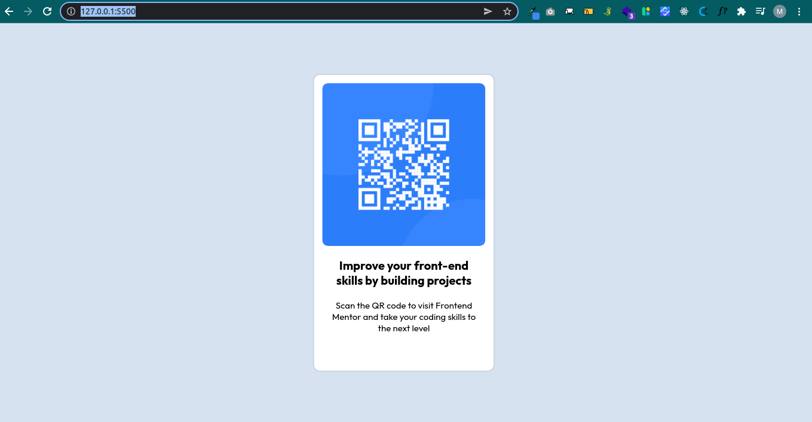

# Frontend Mentor - QR code component solution

This is a solution to the [QR code component challenge on Frontend Mentor](https://www.frontendmentor.io/challenges/qr-code-component-iux_sIO_H). Frontend Mentor challenges help you improve your coding skills by building realistic projects. 

## Table of contents

- [Frontend Mentor - QR code component solution](#frontend-mentor---qr-code-component-solution)
  - [Table of contents](#table-of-contents)
  - [Overview](#overview)
    - [Screenshot](#screenshot)
    - [Links](#links)
  - [My process](#my-process)
    - [Built with](#built-with)
    - [What I learned](#what-i-learned)
    - [Continued development](#continued-development)
    - [Useful resources](#useful-resources)
  - [Author](#author)

## Overview

### Screenshot

### Links
- Solution URL: 
- Live Site URL: 

## My process

### Built with

- Semantic HTML5 markup
- CSS styling
- Flexbox
- Desktop-first workflow

### What I learned

- Became better with responsive styling

### Continued development

- Still responsive styling

### Useful resources

- [px to rem converter](https://nekocalc.com/px-to-rem-converter) - This helped me with converting px values to rem
- [Responsive Viewer](https://chrome.google.com/webstore/detail/responsive-viewer/inmopeiepgfljkpkidclfgbgbmfcennb) - This is an amazing Chrome extension, been using it for some  months now, but it really helps me with responsive styling

## Author

- Website - Mary Ojo
- Frontend Mentor - [@maryojo](https://www.frontendmentor.io/profile/maryojo)
- Twitter - [@maryojo_mo](https://www.twitter.com/maryojo_mo)
